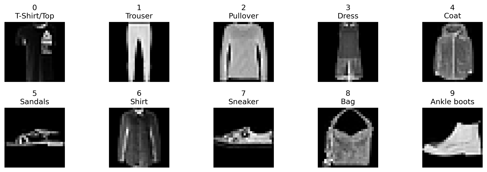
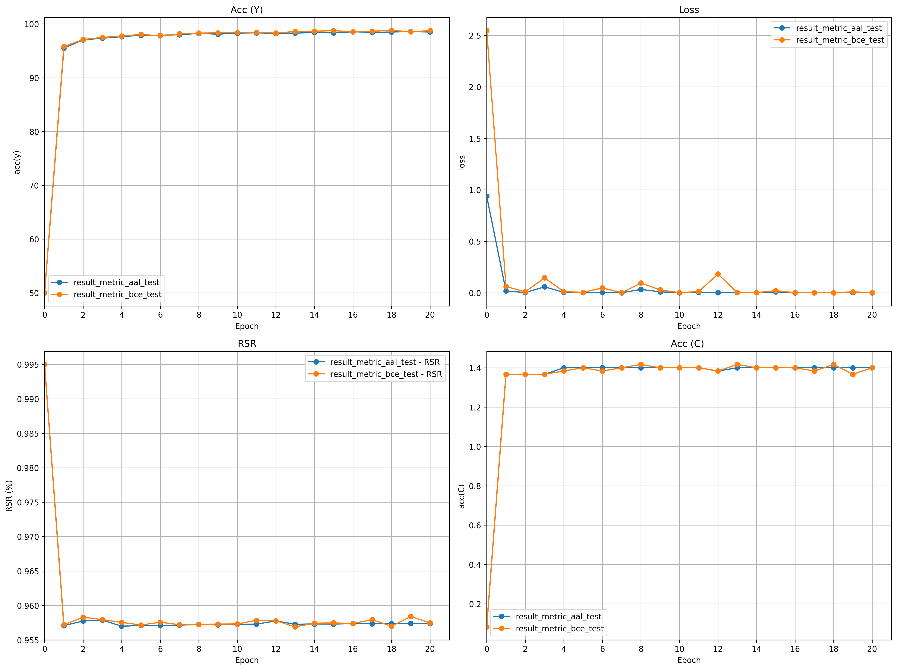
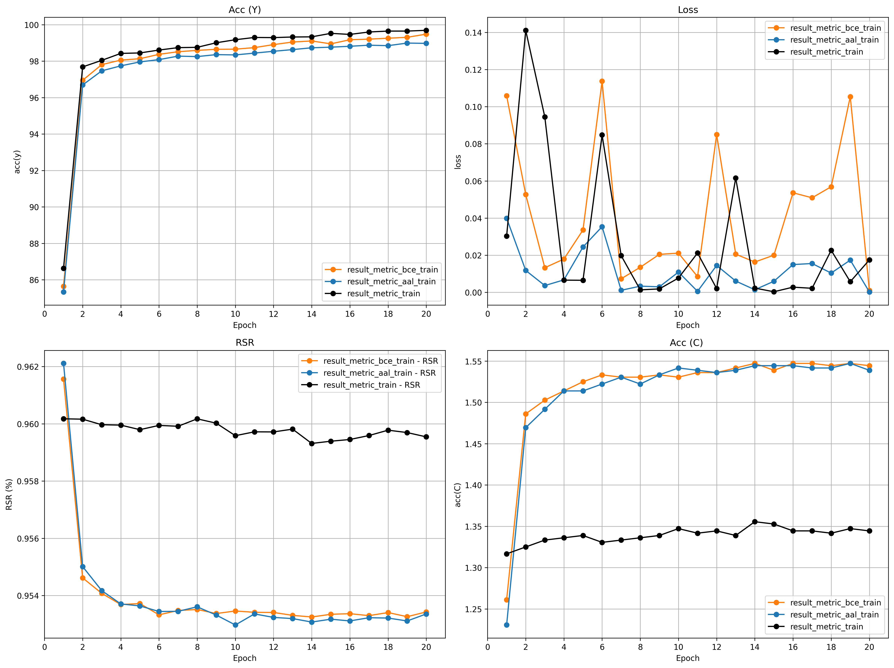

# Experiment 

**Date**: 15/07/2026

**Name of the experiment**: Outfit valid

**Responsible**: Christian Barreto

**Aim**: Predict if outfit is valid through of three imagens

## Tool and configuration
**Languaje**: Python - 3.9

**Nesy**: Scallopy - 0.1.4

**Dataset**: MNIST-FASHION [1]

**Neural model**:

**Rules logical**:
```
upper = {0,2,4,6}
lower = {1}
shoe  = {5,7,9}

digit_1(X),  X ∈ {0,1,2,3,4,5,6,7,8,9}
digit_2(Y),  Y ∈ {0,1,2,3,4,5,6,7,8,9}
digit_3(Z),  Z ∈ {0,1,2,3,4,5,6,7,8,9}

digit_1(X) ∧ upper(X) → has_upper(X)
digit_2(X) ∧ lower(X) → has_lower(X)
digit_3(X) ∧ shoe(X)  → has_shoe(X)

has_upper(U) ∧ has_lower(L) ∧ has_shoe(S) → valid
```
**Hyper parameters**:
- **Epoch**: 20
- **Bash size**: 64
- **Learning rate**: 0,0001
- **Loss function**: Binary Cross Entropy
- **Seed**: 1234
- **Provinence**: difftopkproofs
- **Top-k**: 3
## Method
To prefdict if outfit is valid or not, used a program NeSy where we have three inputs and one output:

**Input**: Three imagens

**Output**: A variable boolean that "**1**" is valid and "**0**" is invalid

In Figure 1, you can seen the flow of work, It have three imagens as input, each one passes through the same neural network, it predict a concepts (C1, C2, C3) for each imagen, after these concepts are used in model logic, In this model predicted if outfit is valid or not according to the rules.

## Result



## Conclusions and notes

## References
```
1. https://arxiv.org/pdf/1708.07747
```