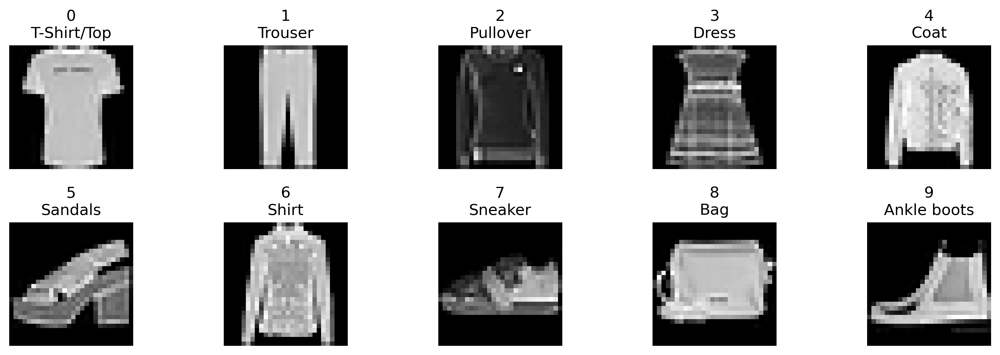
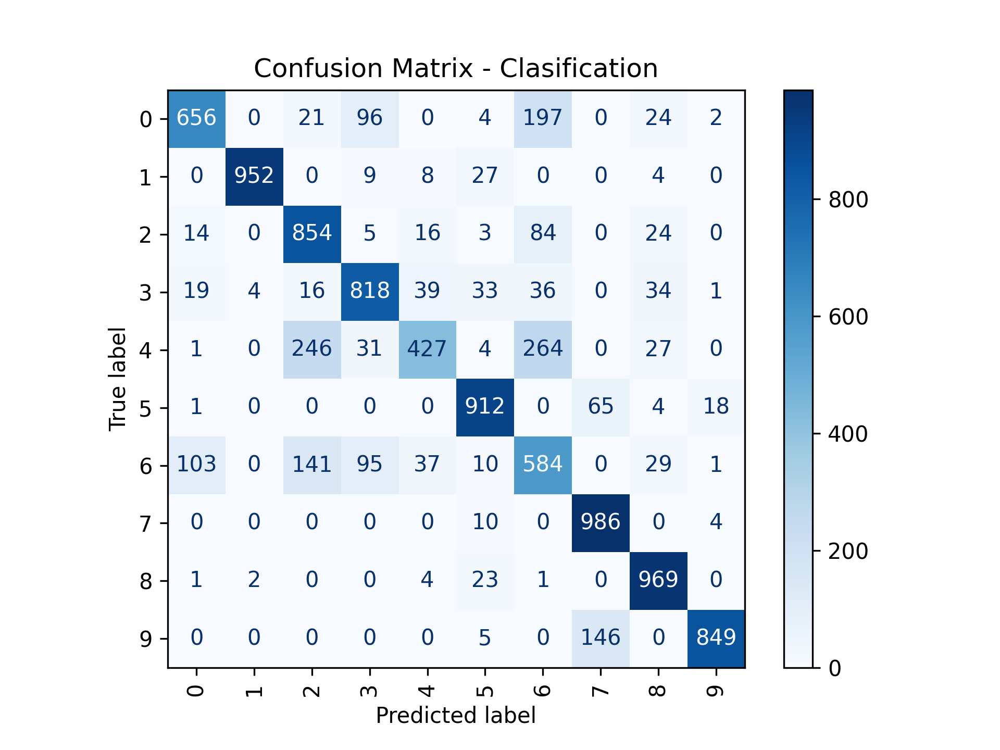

# Experiment 

**Date**: 06/08/2026

**Name of the experiment**: Dataset FASHION

**Responsible**: Christian Barreto

**Aim**: Create a dataset labeling with openCLIP based dataset NMIST-Fashion

## Tool and configuration
**Languaje**: Python - 3.9

**Dataset**: MNIST-FASHION [reference][1].

**Model AI**: CLIP [reference][2].

**Model Pretraining**: OpenCLIP [reference][3]

model_name = "ViT-B-32"

pretrained = "laion2b_s34b_b79k"

num_classes = 10

freeze_backbone = False

## Method
We working with estrategie Weak Beal
### 1. Dataset
### 2. Modelo
### 3. Fluxo

## Result

## References

[1]: https://arxiv.org/pdf/1708.07747 "MNIST-FASHION Dataset"
[2]: https://openai.com/index/clip/ "CLIP"
[3]: https://huggingface.co/docs/hub/open_clip "OpenCLIP"